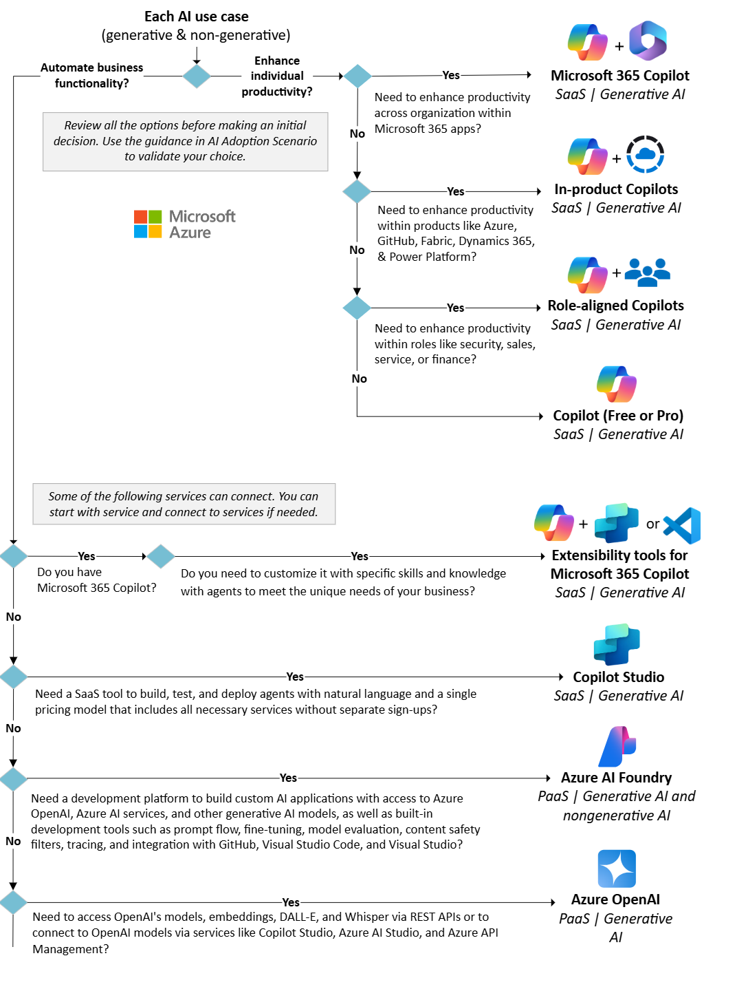

     <form id="quizForm">
        <h3>Question 1: Your organization is planning to implement AI solutions to boost employee productivity. The management wants to automate tasks like drafting documents, summarizing emails, and generating reports directly within existing tools like Word and Excel, without building custom integrations or requiring developers to intervene. Additionally, the solution must cater to the entire organization, scaling across departments seamlessly. What would be the most appropriate solution for this scenario?</h3>
        <input type="radio" name="q1" value="A"> A) Use Microsoft 365 Copilot to embed AI capabilities directly into existing tools for organization-wide productivity gains. 
        <input type="radio" name="q1" value="B"> B) Implement Role-aligned Copilots to address department-specific use cases like security or sales. 
        <input type="radio" name="q1" value="C"> C) Develop custom AI solutions using Azure AI Foundry to integrate advanced capabilities into Microsoft 365 apps. 
        <input type="radio" name="q1" value="D"> D) Build and train AI agents in Copilot Studio and deploy them for document and email automation. 

        <h3>Question 2: A startup specializing in customer service automation wants to streamline how they create and deploy virtual agents to handle common queries. They require a solution that allows them to build agents with natural language capabilities without worrying about managing infrastructure or multiple subscriptions. The system should also allow them to test and deploy agents quickly to adapt to customer needs. Which option would fulfill all these requirements?</h3>
        <input type="radio" name="q2" value="A"> A) Utilize Copilot Studio to build, test, and deploy AI-powered agents through a simplified SaaS platform. 
        <input type="radio" name="q2" value="B"> B) Deploy Microsoft 365 Copilot to handle customer service automation and integrate it into their CRM. 
        <input type="radio" name="q2" value="C"> C) Leverage Azure OpenAI services to build custom APIs and handle natural language processing. 
        <input type="radio" name="q2" value="D"> D) Use Role-aligned Copilots to deploy agents for customer service in specific roles like sales or finance. 

        <h3>Question 3: You are a developer in an enterprise that already uses Microsoft 365 Copilot. Your team needs to enhance Copilot's functionality by adding custom knowledge about your company’s products and integrating it with existing CRM systems. Which tool would you choose?</h3>
        <select name="q3">
            <option value="A">A) Copilot Studio</option>
            <option value="B">B) Extensibility tools for Microsoft 365 Copilot</option>
            <option value="C">C) Role-aligned Copilots</option>
            <option value="D">D) Azure AI Foundry</option>
        </select>

        <h3>Question 4: A tech company is developing a new application that requires advanced natural language processing, image generation, and speech-to-text capabilities. They want full access to pre-trained models like GPT, DALL-E, and Whisper via REST APIs to integrate these functionalities into their custom software. The company also needs flexibility to fine-tune models and implement specific use cases such as content moderation and custom chatbot development. Which solution should they choose?</h3>
        <select name="q4">
            <option value="A">A) Azure AI Foundry</option>
            <option value="B">B) Azure OpenAI</option>
            <option value="C">C) Copilot Studio</option>
            <option value="D">D) Extensibility tools for Microsoft 365 Copilot</option>
        </select>

        <h3>Question 5: Your organization needs a tool to create and deploy conversational AI agents to automate customer support. The tool should allow non-technical users to build agents using natural language inputs without requiring coding expertise. The solution should also streamline the testing and deployment process, bundling all necessary services under a unified pricing model. The ideal tool for this requirement is ________.</h3>
        <input type="text" name="q5">  

        <button type="button" onclick="checkAnswers()">Submit</button>
        <button type="button" onclick="clearAll()">Clear All</button>
    </form>

  

